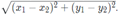

## To complete this exercise:
Add a distance declaration to the RouteModel::Node class in route_model.h. This method should take a Node object as the argument, and it should return a float. The distance method shouldn’t change the object being passed, so you can make it a const method (add const after the function name).
Return the euclidean distance from the current node to the node passed in. Note that for points (x_1, y_1)(x1​,y1​) and (x_2, y_2)(x2​,y2​), the euclidean distance is given by

Have a look at the [video](https://www.bootcampai.org/courses/c-developer-nanodegree-program/lesson/10-code-write-the-distance-function) below for a brief overview of this file.
